<div align="center">

```
  █████╗ ███████╗████████╗██╗  ██╗███████╗██████╗
 ██╔══██╗██╔════╝╚══██╔══╝██║  ██║██╔════╝██╔══██╗
 ███████║█████╗     ██║   ███████║█████╗  ██████╔╝
 ██╔══██║██╔══╝     ██║   ██╔══██║██╔══╝  ██╔══██╗
 ██║  ██║███████╗   ██║   ██║  ██║███████╗██║  ██║
 ╚═╝  ╚═╝╚══════╝   ╚═╝   ╚═╝  ╚═╝╚══════╝╚═╝  ╚═╝
```

### 🗣️ L5 Real-Time Voice Interface

[](https://python.org)
[](https://groq.com)
[](https://ai.meta.com/llama/)
[](https://github.com/rany2/edge-tts)
[](LICENSE)

**Part of the Titan Protocol Initiative — System 06/300**

_Bi-Directional Voice Stream • Ultra-Low Latency • TUI Dashboard_

---

[Quick Start](#-quick-start) •
[Features](#-features) •
[Architecture](#-architecture) •
[Titan Protocol](#-titan-protocol)

</div>

---

## 🚀 Quick Start

```bash
# Clone Repository
git clone https://github.com/DaviBonetto/AETHER-L5-RealTime-Voice-Stream.git
cd AETHER-L5-RealTime-Voice-Stream

# Install Dependencies
pip install -r requirements.txt

# Start System
python src/main.py
```

---

## 🧠 Features

AETHER serves as the auditory cortex of the Titan Protocol:

### 🗣️ **Conversational Engine**

- **STT (Ear)**: `Groq Whisper-Large-v3` for blazing fast transcription.
- **LLM (Brain)**: **`Llama-3.3-70b-Versatile`** for state-of-the-art reasoning.
- **TTS (Mouth)**: `Edge-TTS` (ChristopherNeural) for natural neural speech.
- **UI/UX**: Premium **Terminal User Interface (TUI)** powered by Rich.

---

## 🏗️ Architecture

```mermaid
graph LR
    Mic["🎤 Microphone"] -->|Audio| Ears["👂 Whisper STT"]
    Ears -->|Text| Brain["🧠 Llama 3.3 (Groq)"]
    Brain -->|Text| Mouth["🗣️ Edge TTS"]
    Mouth -->|Audio Stream| Speaker["🔊 Output"]

    style Brain fill:#f55036,stroke:#fff,stroke-width:2px,color:#fff
    style Ears fill:#3776ab,stroke:#fff,stroke-width:1px,color:#fff
    style Mouth fill:#0078d4,stroke:#fff,stroke-width:1px,color:#fff
```



---

## 📁 Project Structure

```
src/
├── core/
│   ├── stt.py           # Whisper Interface
│   ├── llm.py           # Llama 3.3 Interface
│   └── tts.py           # Edge-TTS Interface
├── ui/
│   └── display.py       # Rich TUI System
├── utils/
│   └── audio.py         # Audio I/O Manager
└── main.py              # Event Loop
```

---

## 🔗 Titan Protocol Initiative

AETHER is part of the **Titan Protocol**, a collection of 300 autonomous high-performance systems.

| System | Name        | Technology          | Repository                                                                 |
| ------ | ----------- | ------------------- | -------------------------------------------------------------------------- |
| 01/300 | **GENESIS** | Rust + Bloom Filter | [GitHub](https://github.com/DaviBonetto/GENESIS-L5-HighPerf-URL-Shortener) |
| 02/300 | **VORTEX**  | Python + LangGraph  | [GitHub](https://github.com/DaviBonetto/VORTEX-L4-Deep-Research-Agent)     |
| 03/300 | **NEXUS**   | Rust + Vector DB    | [GitHub](https://github.com/DaviBonetto/NEXUS-L4-HighPerf-Vector-DB)       |
| 04/300 | **OPTICUS** | Python + YOLOv8     | [GitHub](https://github.com/DaviBonetto/OPTICUS-L3-Vision-Grid)            |
| 05/300 | **KRONOS**  | React + Vite        | [GitHub](https://github.com/DaviBonetto/KRONOS-L5-Neural-Interface)        |
| 06/300 | **AETHER**  | Python + Voice      | **You are here**                                                           |

---

## 📄 License

This project is licensed under the **MIT License** - see the [LICENSE](LICENSE) file for details.

---

<div align="center">

**Built with ⚡ Groq + 🎤 Edge-TTS by [Davi Bonetto](https://github.com/DaviBonetto)**

_Part of the Titan Protocol Initiative_

⭐ Star this repo if you find it useful!

</div>
